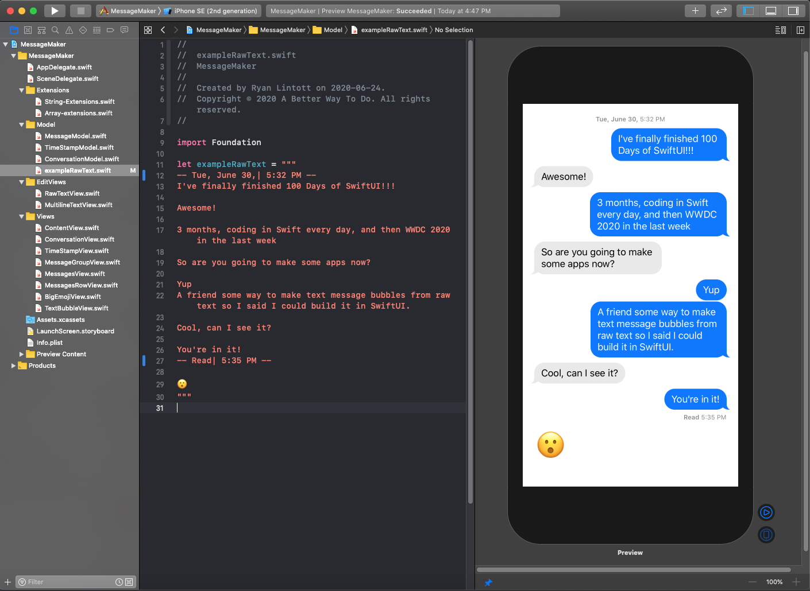

# MessageMaker
A friend of mine was writing fanfic and wanted a way to generate a lot of text message screenshots out of raw text. I wanted a way to practice the SwiftUI I was learning so here we are!

## Formatting Rules
- Each line of text counts as one message
- First message is from "you"
- Leaving a blank line changes the sender
- Adding a line surrounded by "< " and " >" will create timestamp text
- Text to the left of "|" in a timestamp will be bold
- Timestamp text as a first line or after a blank line will appear in the middle (useful for date stamps).
- Timestamp text directly after a message will appear under that message (useful for "read" or "delivered" timestamps).
